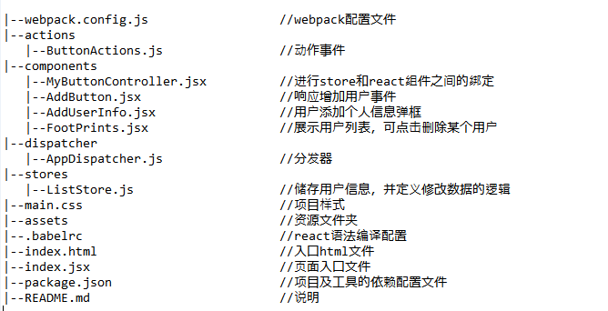
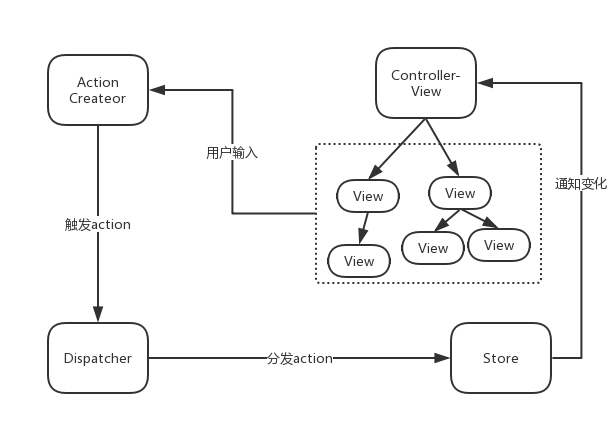

本例子采用**react+flux+webpack**的方式实现用户列表，其功能点包括显示、增加和删除操作。
## Table of Contents ##

## Core Achieve##
- 采用**flux**架构模式使数据和逻辑永远单向流动，避免了MVC架构的混乱的数据流动方式
- 使用**localstorage**存储用户数据，借助JSON对象实现对象数组的序列化和反序列化
- 使用**filereader**API将图片转化为DataURI，从而实现图片的本地存储   
     
## flux module ##

Flux将一个应用分为四个部分
* View负责订阅store中的数据，并使用这些数据渲染相关的页面
* Action表示View层发出的消息
* dispatcher负责分发事件
* store负责保存事件
尽管flux看起来和MVC架构有点像，但是其中并没有一个职责明确的controller。flux中存在一个**controller-view**的角色，它是整个应用最顶层的view，不涉及具体的业务逻辑，其职责是将view和store进行绑定，定义数据更新和传递的方式，并没有传统MVC中controller需要承担的复杂逻辑。

## Problems encountered ##

- react使用JSX编写HTML和CSS，依靠JSX渲染所有的组件，对于先接触了vue的我来说，写代码有点不习惯，不过JSX语法比较简约也容易上手，所以不造成很大困难.
- react父子组件通信问题，react使用props属性将值从父组件向子组件传播，而子组件使用function prop与父组件通信，这点与vue不同，vue子组件使用 $emit(eventName) 触发父组件的事件。
- 本例子使用babel转码器将JSX转码为Javascript，在使用webpack过程中loader存在版本不兼容的问题，所以出现一些错误，不过后来通过查阅资料解决了.
- localstorage只能存放string字符串，对于用户数据，为了存取方便，采用JSON.stringify和JSON.parse解析数组对象。此外，为了存取图片，将图片转化为了DataURI.

## Insufficient ##
- 没有留出充足的时间学习redux和测试框架Jest，所以只采用了flux架构模式
- 对于control-view模式没有深刻理解
- 代码规范还不到位

## Plan ##
- 继续把《深入react技术栈》这本书看完，后面抽空把这个例子改成基于react+redux+Typescript模式

